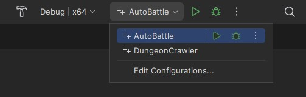

# C++ Study Assignments
Collection of two C++ console projects for practicing basic concepts of the language.

## Setup

The solution was created using [Rider](https://www.jetbrains.com/pt-br/rider/) and [Visual Studio](https://visualstudio.microsoft.com/pt-br/vs/community/) toolset for compiling the projects. If you don't have any of those IDE, a separate compiler will be required to run the project, such as CMake.

### Rider
* Make sure you have [Visual Studio](https://visualstudio.microsoft.com/pt-br/vs/community/) installed with C++ desktop development checked during installation (Rider uses this toolset for compiling);
* Open `CppStudyAssignments.sln` solution;
* On topmost right corner, select which project you want to run.

## Projects

### Dungeon Crawler

A console game which simulates battles between the player and a chosen number of enemies, showing the battle outcome.

### Auto Battle

The concept is similar to the Dungeon Crawler, but with the addition of a grid battlefield for character movement, character classes and special abilities.
Characters need to move closer to the target position or use a special ranged ability (if owns one) to attack, on a turn based action.
